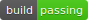
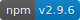

# 1 安装脚手架 vue-cli

# vue-cli [](https://circleci.com/gh/vuejs/vue-cli) [](https://www.npmjs.com/package/vue-cli)

A simple CLI for scaffolding Vue.js projects.

### Installation

Prerequisites: [Node.js](https://nodejs.org/en/) (>=6.x, 8.x preferred), npm version 3+ and [Git](https://git-scm.com/).

```
$ npm install -g vue-cli
```

### Usage

```
$ vue init <template-name> <project-name>
```

Example:

```
$ vue init webpack my-project
```

更多：https://www.npmjs.com/package/vue-cli

# 2 项目文件

​	build -- webpack配置相关

.gitkeep 提交空文件


# 3 模拟数据 mock

## issues: vue-cli 升级后没有dev-server.js

~~~
//webpack.dev.conf.js数据：
'use strict'
const utils = require('./utils')
const webpack = require('webpack')
const config = require('../config')
const merge = require('webpack-merge')
const path = require('path')
const baseWebpackConfig = require('./webpack.base.conf')
const CopyWebpackPlugin = require('copy-webpack-plugin')
const HtmlWebpackPlugin = require('html-webpack-plugin')
const FriendlyErrorsPlugin = require('friendly-errors-webpack-plugin')
const portfinder = require('portfinder')

const express = require('express')

const HOST = process.env.HOST
const PORT = process.env.PORT && Number(process.env.PORT)


let app = express()

let appData = require('../data.json');
let seller = appData.seller;
let goods = appData.goods;
let ratings = appData.ratings;

let apiRoutes = express.Router();

//奇怪这里已经不起作用了,只能在下面手动添加
//app.use('/api', apiRoutes);


const devWebpackConfig = merge(baseWebpackConfig, {
  module: {
    rules: utils.styleLoaders({ sourceMap: config.dev.cssSourceMap, usePostCSS: true })
  },
  // cheap-module-eval-source-map is faster for development
  devtool: config.dev.devtool,

  // these devServer options should be customized in /config/index.js
  devServer: {
    before(app){
      app.get('/api/seller', function (req, res) {
        res.json({
          errno: 0,
          data: seller
        });
      });
      app.get('/api/goods', function (req, res) {
        res.json({
          errno: 0,
          data: goods
        });
      });
      app.get('/api/ratings', function (req, res) {
        res.json({
          errno: 0,
          data: ratings
        });
      });
    },
    clientLogLevel: 'warning',
    historyApiFallback: {
      rewrites: [
        { from: /.*/, to: path.posix.join(config.dev.assetsPublicPath, 'index.html') },
      ],
    },
    hot: true,
    contentBase: false, // since we use CopyWebpackPlugin.
    compress: true,
    host: HOST || config.dev.host,
    port: PORT || config.dev.port,
    open: config.dev.autoOpenBrowser,
    overlay: config.dev.errorOverlay
      ? { warnings: false, errors: true }
      : false,
    publicPath: config.dev.assetsPublicPath,
    proxy: config.dev.proxyTable,
    quiet: true, // necessary for FriendlyErrorsPlugin
    watchOptions: {
      poll: config.dev.poll,
    }
  },
  plugins: [
    new webpack.DefinePlugin({
      'process.env': require('../config/dev.env')
    }),
    new webpack.HotModuleReplacementPlugin(),
    new webpack.NamedModulesPlugin(), // HMR shows correct file names in console on update.
    new webpack.NoEmitOnErrorsPlugin(),
    // https://github.com/ampedandwired/html-webpack-plugin
    new HtmlWebpackPlugin({
      filename: 'index.html',
      template: 'index.html',
      inject: true
    }),
    // copy custom static assets
    new CopyWebpackPlugin([
      {
        from: path.resolve(__dirname, '../static'),
        to: config.dev.assetsSubDirectory,
        ignore: ['.*']
      }
    ])
  ]
})

module.exports = new Promise((resolve, reject) => {
  portfinder.basePort = process.env.PORT || config.dev.port
  portfinder.getPort((err, port) => {
    if (err) {
      reject(err)
    } else {
      // publish the new Port, necessary for e2e tests
      process.env.PORT = port
      // add port to devServer config
      devWebpackConfig.devServer.port = port

      // Add FriendlyErrorsPlugin
      devWebpackConfig.plugins.push(new FriendlyErrorsPlugin({
        compilationSuccessInfo: {
          messages: [`Your application is running here: http://${devWebpackConfig.devServer.host}:${port}`],
        },
        onErrors: config.dev.notifyOnErrors
        ? utils.createNotifierCallback()
        : undefined
      }))

      resolve(devWebpackConfig)
    }
  })
})

~~~


# 3 图标字体制作

https://icomoon.io/

将自己的svg图标导入，转成自己的字体图标

-->Generate Font


# 4 安装 jsonview插件


