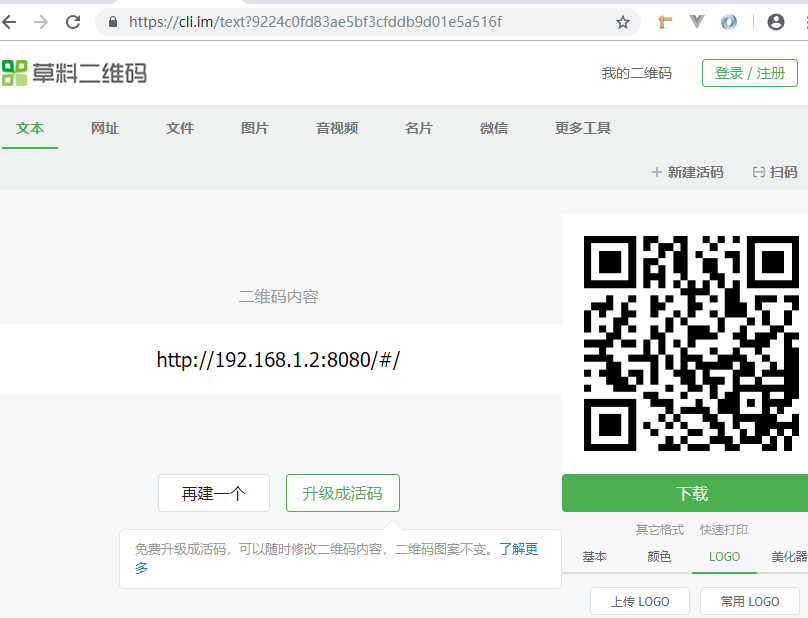
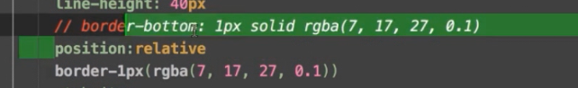
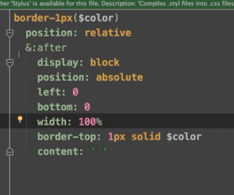
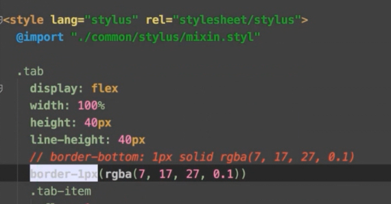
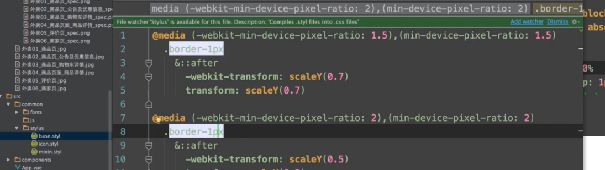
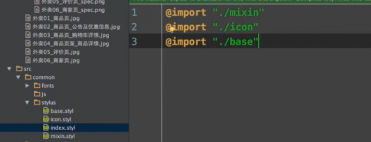
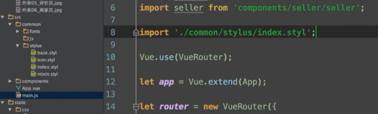
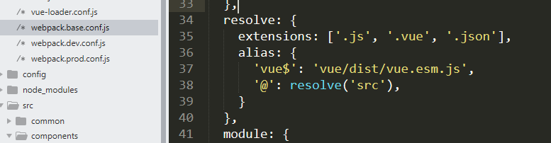

# 1 安装脚手架 vue-cli

# vue-cli [](https://circleci.com/gh/vuejs/vue-cli) [](https://www.npmjs.com/package/vue-cli)

A simple CLI for scaffolding Vue.js projects.

### Installation

Prerequisites: [Node.js](https://nodejs.org/en/) (>=6.x, 8.x preferred), npm version 3+ and [Git](https://git-scm.com/).

```
$ npm install -g vue-cli
```

### Usage

```
$ vue init <template-name> <project-name>
```

Example:

```
$ vue init webpack my-project
```

更多：https://www.npmjs.com/package/vue-cli

# 2 项目文件

​	build -- webpack配置相关

.gitkeep 提交空文件


# 3 模拟数据 mock

## issues: vue-cli 升级后没有dev-server.js

~~~
//webpack.dev.conf.js数据：
'use strict'
const utils = require('./utils')
const webpack = require('webpack')
const config = require('../config')
const merge = require('webpack-merge')
const path = require('path')
const baseWebpackConfig = require('./webpack.base.conf')
const CopyWebpackPlugin = require('copy-webpack-plugin')
const HtmlWebpackPlugin = require('html-webpack-plugin')
const FriendlyErrorsPlugin = require('friendly-errors-webpack-plugin')
const portfinder = require('portfinder')

const express = require('express')

const HOST = process.env.HOST
const PORT = process.env.PORT && Number(process.env.PORT)


let app = express()

let appData = require('../data.json');
let seller = appData.seller;
let goods = appData.goods;
let ratings = appData.ratings;

let apiRoutes = express.Router();

//奇怪这里已经不起作用了,只能在下面手动添加
//app.use('/api', apiRoutes);


const devWebpackConfig = merge(baseWebpackConfig, {
  module: {
    rules: utils.styleLoaders({ sourceMap: config.dev.cssSourceMap, usePostCSS: true })
  },
  // cheap-module-eval-source-map is faster for development
  devtool: config.dev.devtool,

  // these devServer options should be customized in /config/index.js
  devServer: {
    before(app){
      app.get('/api/seller', function (req, res) {
        res.json({
          errno: 0,
          data: seller
        });
      });
      app.get('/api/goods', function (req, res) {
        res.json({
          errno: 0,
          data: goods
        });
      });
      app.get('/api/ratings', function (req, res) {
        res.json({
          errno: 0,
          data: ratings
        });
      });
    },
    clientLogLevel: 'warning',
    historyApiFallback: {
      rewrites: [
        { from: /.*/, to: path.posix.join(config.dev.assetsPublicPath, 'index.html') },
      ],
    },
    hot: true,
    contentBase: false, // since we use CopyWebpackPlugin.
    compress: true,
    host: HOST || config.dev.host,
    port: PORT || config.dev.port,
    open: config.dev.autoOpenBrowser,
    overlay: config.dev.errorOverlay
      ? { warnings: false, errors: true }
      : false,
    publicPath: config.dev.assetsPublicPath,
    proxy: config.dev.proxyTable,
    quiet: true, // necessary for FriendlyErrorsPlugin
    watchOptions: {
      poll: config.dev.poll,
    }
  },
  plugins: [
    new webpack.DefinePlugin({
      'process.env': require('../config/dev.env')
    }),
    new webpack.HotModuleReplacementPlugin(),
    new webpack.NamedModulesPlugin(), // HMR shows correct file names in console on update.
    new webpack.NoEmitOnErrorsPlugin(),
    // https://github.com/ampedandwired/html-webpack-plugin
    new HtmlWebpackPlugin({
      filename: 'index.html',
      template: 'index.html',
      inject: true
    }),
    // copy custom static assets
    new CopyWebpackPlugin([
      {
        from: path.resolve(__dirname, '../static'),
        to: config.dev.assetsSubDirectory,
        ignore: ['.*']
      }
    ])
  ]
})

module.exports = new Promise((resolve, reject) => {
  portfinder.basePort = process.env.PORT || config.dev.port
  portfinder.getPort((err, port) => {
    if (err) {
      reject(err)
    } else {
      // publish the new Port, necessary for e2e tests
      process.env.PORT = port
      // add port to devServer config
      devWebpackConfig.devServer.port = port

      // Add FriendlyErrorsPlugin
      devWebpackConfig.plugins.push(new FriendlyErrorsPlugin({
        compilationSuccessInfo: {
          messages: [`Your application is running here: http://${devWebpackConfig.devServer.host}:${port}`],
        },
        onErrors: config.dev.notifyOnErrors
        ? utils.createNotifierCallback()
        : undefined
      }))

      resolve(devWebpackConfig)
    }
  })
})

~~~


# 3 图标字体制作

https://icomoon.io/

将自己的svg图标导入，转成自己的字体图标

-->Generate Font


# 4 安装 jsonview插件(可忽略)


# 5 使用cssreset官网提供的默认样式

1 引入默认样式  https://cssreset.com/

2 视口   适应移动端


# 语法严格模式Eslin

3 .eslintrc.js文件

//严格格式加';'

'semi': ['error', 'always']


# 6 flex布局

https://juejin.im/post/5c08e9ea6fb9a049e6600c21


# 7 CSS问题

## 书写格式 

样式布局写前面

接下来是宽高

最后是样式颜色等可被继承的

## 1 postcss插件可以搞定css兼容问题。。

1. 行内元素a转为块元素，点击的时候才可以一大块点击


# 8 stylus样式

&  父元素

& > a 父元素的子元素active  

&.active  父元素的active类样式


# 9 vue-router

https://router.vuejs.org/guide/#html

linkActiveClass 被激活时TAB的样式


### Router Construction Options

#### linkActiveClass

- type: `string`

- default: `"router-link-active"`

  Globally configure `<router-link>` default active class. Also see [router-link](https://router.vuejs.org/api/#router-link)

~~~
export default new Router({
  routes,
  linkActiveClass: 'active'
});
~~~


# 10 通过手机端浏览PC端的网址

1 https://cli.im/  

 将你的IP：端口贴到上面这个网址上，会生成二维码

2 ，保证 PC和手机在同一局域网内，扫二维码可获取地址查看 

3 Vue开发 localhost 替换成 本机ip无法访问

新版 vue-cli（@3.10.10） 构建的项目。localhost 替换成本机 ip 地址之后无法访问。但是替换成 127.0.0.1 可以访问

找到 config 文件夹下面的 index.js 里面的 dev，把 host 的值改成 0.0.0.0

4 如图




# 11. 实现通用的1像素border

1像素在PC与手机上的显示



上两和下1一样



mixin.styl

@import引用



根据手机缩放











可以改路径


# 12 vue-resource

https://github.com/pagekit/vue-resource/tree/e25df446e1e94f0134888d9bf8fc75bf8ce91d49


https://github.com/pagekit/vue-resource/blob/e25df446e1e94f0134888d9bf8fc75bf8ce91d49/docs/http.md

~~~

import vueResource from 'vue-resource';

Vue.use(vueResource);

  import header from './components/header/header.vue';
  export default{
    created() {
      // GET /someUrl
      this.$http.get('/api/goods').then(response => {
        // get body data
        this.Data = response.body;
        console.log(this.Data);
      }, response => {
        // error callback
      });
    }
  };
~~~


# 13 created 生命周期

Vue的一个生命周期，created

 这是它的一个生命周期[钩子函数](https://www.baidu.com/s?wd=%E9%92%A9%E5%AD%90%E5%87%BD%E6%95%B0&tn=44039180_cpr&fenlei=mv6quAkxTZn0IZRqIHckPjm4nH00T1Y4n1fLPyckrjTznHmknjfs0ZwV5Hcvrjm3rH6sPfKWUMw85HfYnjn4nH6sgvPsT6KdThsqpZwYTjCEQLGCpyw9Uz4Bmy-bIi4WUvYETgN-TLwGUv3EnHb4nWndrHRznW6zPHm1P1b3Ps)，就是一个vue实例被生成后调用这个函数。一个vue实例被生成后还要绑定到某个[html元素](https://www.baidu.com/s?wd=html%E5%85%83%E7%B4%A0&tn=44039180_cpr&fenlei=mv6quAkxTZn0IZRqIHckPjm4nH00T1Y4n1fLPyckrjTznHmknjfs0ZwV5Hcvrjm3rH6sPfKWUMw85HfYnjn4nH6sgvPsT6KdThsqpZwYTjCEQLGCpyw9Uz4Bmy-bIi4WUvYETgN-TLwGUv3EnHb4nWndrHRznW6zPHm1P1b3Ps)上，之后还要进行编译，然后再插入到document中。每一个阶段都会有一个[钩子函数](https://www.baidu.com/s?wd=%E9%92%A9%E5%AD%90%E5%87%BD%E6%95%B0&tn=44039180_cpr&fenlei=mv6quAkxTZn0IZRqIHckPjm4nH00T1Y4n1fLPyckrjTznHmknjfs0ZwV5Hcvrjm3rH6sPfKWUMw85HfYnjn4nH6sgvPsT6KdThsqpZwYTjCEQLGCpyw9Uz4Bmy-bIi4WUvYETgN-TLwGUv3EnHb4nWndrHRznW6zPHm1P1b3Ps)，方便开发者在不同阶段处理不同逻辑。

一般可以在created函数中调用ajax获取页面[初始化](https://www.baidu.com/s?wd=%E5%88%9D%E5%A7%8B%E5%8C%96&tn=44039180_cpr&fenlei=mv6quAkxTZn0IZRqIHckPjm4nH00T1Y4n1fLPyckrjTznHmknjfs0ZwV5Hcvrjm3rH6sPfKWUMw85HfYnjn4nH6sgvPsT6KdThsqpZwYTjCEQLGCpyw9Uz4Bmy-bIi4WUvYETgN-TLwGUv3EnHb4nWndrHRznW6zPHm1P1b3Ps)所需的数据。

## 实例生命周期

每个 Vue 实例在被创建之前都要经过一系列的初始化过程。例如，实例需要配置数据观测(data observer)、编译模版、挂载实例到 DOM ，然后在数据变化时更新 DOM 。在这个过程中，实例也会调用一些 生命周期钩子 ，这就给我们提供了执行自定义逻辑的机会。例如，`created` 这个钩子在实例被创建之后被调用：

也有一些其它的钩子，在实例生命周期的不同阶段调用，如 `mounted`、 `updated` 、`destroyed` 。钩子的 `this` 指向调用它的 Vue 实例。一些用户可能会问 Vue.js 是否有“控制器”的概念？答案是，没有。组件的自定义逻辑可以分布在这些钩子中。

## 生命周期图示

下图说明了实例的生命周期。你不需要立马弄明白所有的东西，不过以后它会有帮助。


