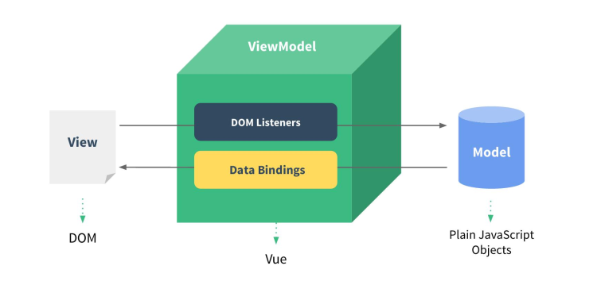

MVVM：

M：v-modle，配置选项中的data

V：view，使用data的值 {{}}

VM：viewModel, vue的一个实例，进行DOM监视与数据绑定

​          input监听：改变输入框内容时触发，把数据保存到data中；数据自动从内存中显示到页面（数据绑定）

demo:

~~~html
<!DOCTYPE html>
<html lang="en">
<head>
	<title>helloworld</title>
	<meta charset="UTF-8">
</head>
<body>
<!--
	1. 引入vue.js
	2. 创建vue对象
	   el:指定根element(选择器)
	   data:初始化数据(页面可以访问)
	3. 双向数据绑定：v-model
	4. 显示数据：{{xxx}}
	5. 理解vue的mvvm实现
-->
<!--模板-->

	<input type="text" v-model="msg">
	
hello {{msg}}

</body>
</html>
~~~

